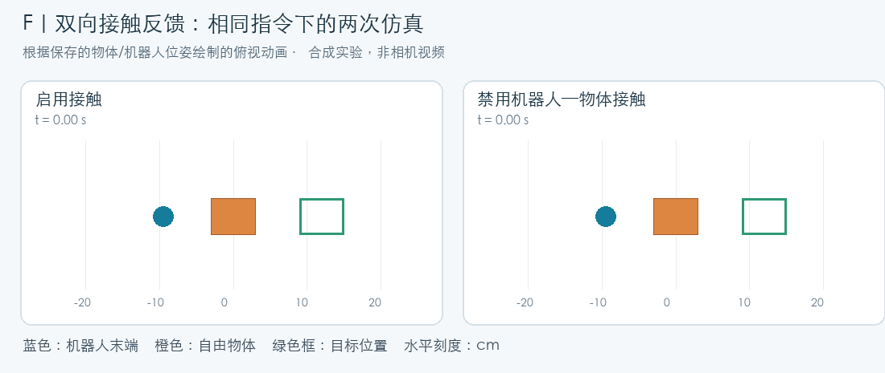
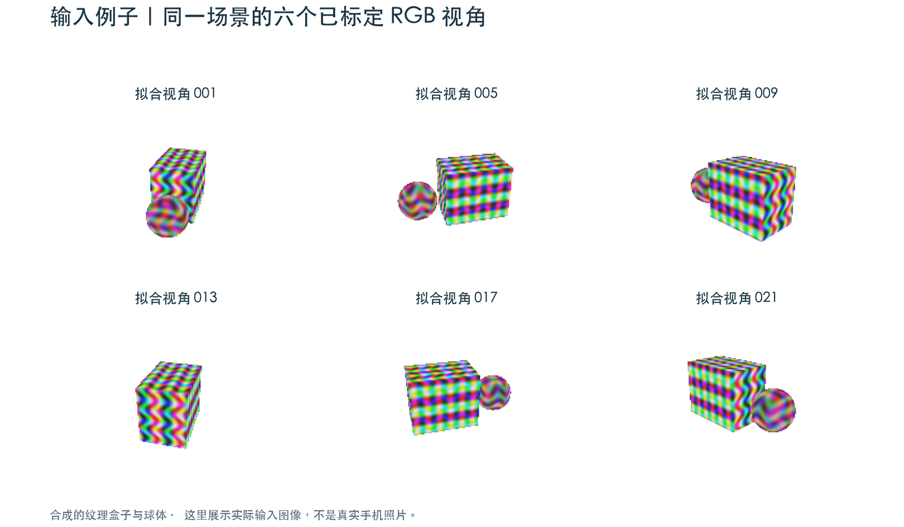
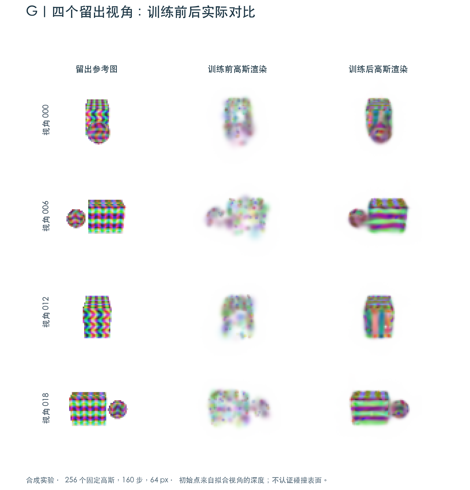
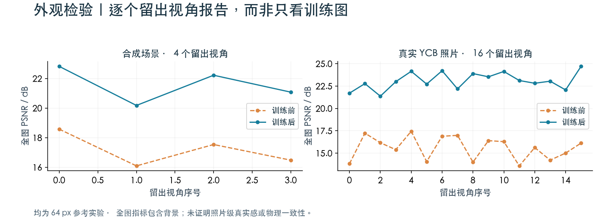
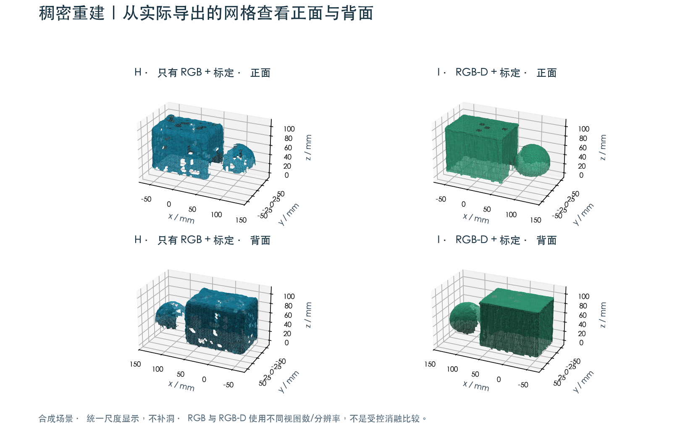
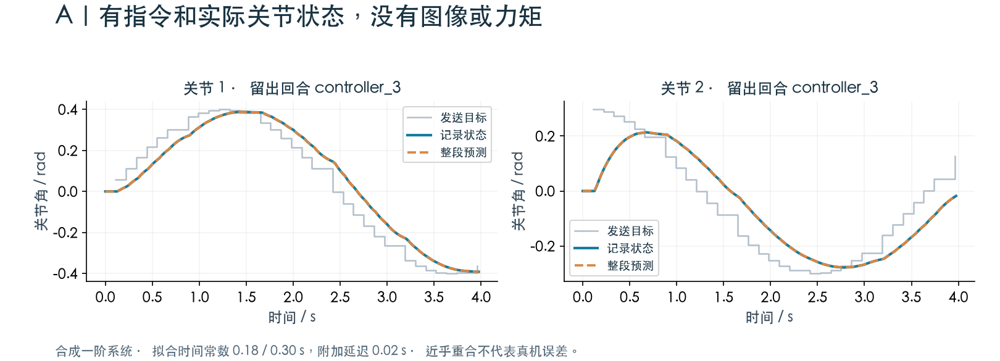
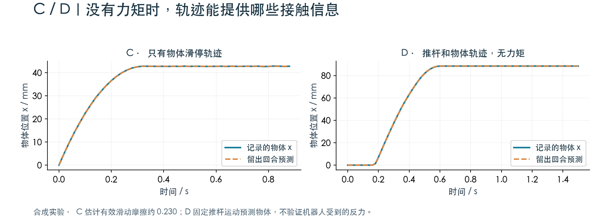
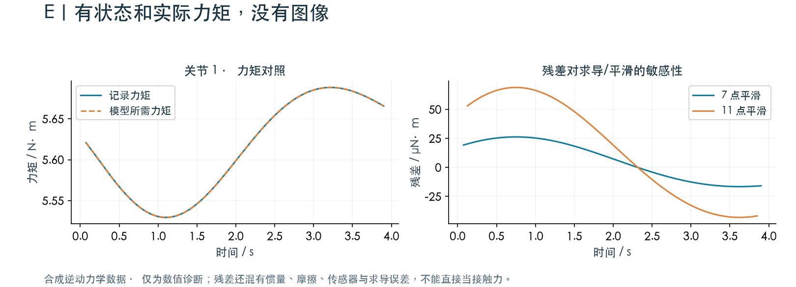
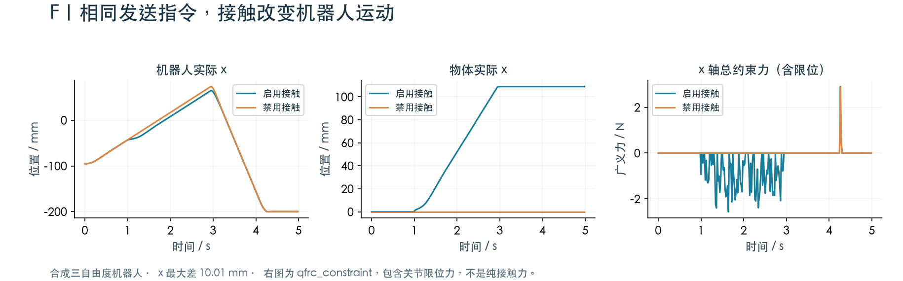

# Evidence Real2Sim

**目标：从图片序列重建完整机器人操作场景，包括桌面、背景、所有任务相关物体、机器人与原始布局。**

完整场景的高保真重建与可交互装配**尚未完成**。下方图集是已经运行的单物体和子模块实验，
不能作为完整场景成果。独立资产只是整场景的组成部分。
请先看[完整工作空间方案与实现状态](docs/WHOLE_WORKSPACE.md)。

Data-aware reconstruction, calibration and robot contact evaluation.

[](https://github.com/pm1255/evidence-real2sim/actions/workflows/tests.yml)
[](LICENSE)

目标是降低真机测评成本。当前已运行 **9 类输入示例、35 项软件检查**，并完成真实照片外观实验。
**尚未证明仿真可以替代真机测评。** 下方图片和动画来自实际运行输出，均注明证据来源。

[输入条件详解](docs/INPUT_CASES.md) · [实验记录与失败项](reports/VALIDATION.md) ·
[安装与完整命令 / English](docs/TECHNICAL_GUIDE.md) · [图片来源](docs/assets/README.md)

新的整场景输入入口 `prepare_workspace.py` 保留完整原始画幅、实例清单和共同坐标系信息；
未知相机位姿不猜测，动态操作序列不静默当静止扫描处理。此入口只做准备和检查，
不代表已经实现完整重建。8 项新增输入范围检查已单独运行。

## 先看生成结果：机器人与物体相互影响



**输入：机器人模型、执行器、初始状态与控制策略。输出：机器人和自由物体的闭环运动、接触反力与任务结果。**
上方为合成三自由度机器人，蓝色是末端，橙色是物体，绿色框是目标。
动画根据保存的仿真位姿绘制，并非相机视频。右侧禁用机器人与物体接触，使用左侧记录的相同目标指令；
机器人会穿过物体，这是该对照实验的设置。左侧任务通过，右侧失败。

## 你的输入不同，能得到什么？

以下 A–I 都有可运行示例。`q` 表示实际关节位置；发送的 `action` 不等于实际状态或实际力矩。

| 情况 | 已有输入 | 实际输出 | 缺少什么 / 不能得出的结论 |
|---|---|---|---|
| **A · 无图像** | 动作目标 + 实际 q + 时间戳 | 控制延迟、响应时间常数、留出轨迹预测 | 不生成视觉资产；不证明接触对齐 |
| **B · 只有 q** | 实际关节轨迹 | 数据审计；控制/接触拟合明确 `skipped` | 没有指令和物体响应，不能凭空估计控制器或摩擦 |
| **C · 只有物体运动** | 已知水平面上的自由滑停轨迹、尺度与初速度 | 有效滑动摩擦、留出滑停预测 | 质量、接触刚度等并未全部识别 |
| **D · 无力矩** | 实际推杆轨迹 + 物体轨迹 | 给定推杆运动下的接触拟合和物体预测 | 推杆运动被规定，未验证机器人反力响应 |
| **E · 有实际力矩** | q、时间、实际力矩、惯性/传动模型 | 逆动力学残差及求导敏感性 | 残差不等于已校准的真实接触力 |
| **F · 完整动力学模型** | 模型 + 执行器 + 策略/指令 | 双向接触反馈、状态轨迹、仿真成功判定 | 仍需真机数据校准模型与控制器 |
| **G · 标定 RGB** | 多视角照片、内外参、拟合数据产生的初始点 | 3D 高斯 PLY、留出渲染、外观指标 | 高斯外观不直接认证碰撞几何 |
| **H · RGB，无深度** | 多视角 RGB + 标定 + 米制尺度 | 估计深度、筛选点云、局部网格 | 弱纹理/遮挡处可能缺失，不自动认证接触表面 |
| **I · RGB-D** | 已配准的彩色/深度、标定、深度单位 | TSDF 融合表面和观测覆盖 | 仍受深度噪声、遮挡、配准误差限制 |
| **无位姿照片** | 一组静态场景照片 | 尝试 SfM 恢复相机与稀疏点 | 本次仅恢复 2/20 个视角，完整重建未通过 |
| **成对真机测评** | 同任务、同条件、固定策略的真实/仿真回合 | 已实现数据检查、误判率与排序统计 | 当前没有匹配真机回合，尚无替代测评结论 |

## G｜有标定图像：输入照片 → 3D 高斯外观

下面是可复现的**合成纹理盒子与球体**，展示六个拟合视角。相机位置和尺度已知。



优化高斯中心、旋转、尺度、不透明度和颜色后，四个未参与拟合的视角如下。
展示全部四个留出视角，而非只选择最好的一张。



**实际输出：** `gaussians.ply`、`gaussians.npz`、`heldout_*.png`、`training_report.json`。
合成实验使用 256 个固定高斯、160 步、64 px，平均留出 PSNR **17.18 → 21.57 dB**。
本例的初始点来自拟合视角的合成深度，因此不是“只凭未知位姿 RGB”的端到端证明。
当前 CPU 参考实现没有自适应增密；图片模糊与细节缺失在展示中原样保留。

### 再看真实照片：逐视角外观检验



另一个已运行实验使用 **96 张真实 YCB 图像与已发布标定：80 张拟合、16 张留出**，
320 个高斯、320 步、64 px。平均留出 PSNR **15.58 → 23.09 dB**，轮廓 IoU **0.924**。
初始点来自拟合轮廓生成的视觉外壳。这里发布数值结果，原始第三方照片不随仓库分发。
全图 PSNR 包含背景，不能单独证明物体细节、几何准确或策略评测一致。

## H / I｜有没有深度，生成的表面会怎样？



左侧：从 RGB 估计深度，经跨视角一致性筛选再融合。右侧：直接融合已配准的 RGB-D 深度。
图中使用实际导出的三角网格，统一米制尺度，显示正反两面；没有为了展示而补洞。

| 已运行配置 | 保留点数 | 三角面数 | 重建顶点到已知合成表面的平均 / p95 距离 |
|---|---:|---:|---:|
| H · RGB，16 个拟合视角 | 23,935 | 12,342 | 0.734 / 2.105 mm |
| I · RGB-D，20 个拟合视角 | 61,380 | 18,183 | 0.433 / 1.016 mm |

**实际输出：** `observed_points.ply`、`surface.ply`、逐视角深度和 `dense_report.json`。
两个配置的视图数和分辨率不同，不能把差值解释为单一“增加深度”的受控实验效果。
上表是合成场景的单向采样距离，不是全表面最大误差、完整度保证或 iPhone 深度精度。
真实 YCB 的 RGB 分支也已运行，生成 9,145 个三角面，但表面精度未独立认证。

## A / B｜没有图像：指令是否存在，会改变可识别的内容



**A：动作目标 + 实际状态。** 从三个拟合回合估计一阶响应，在两个完整留出回合上预测。
已恢复合成系统的时间常数 **0.18 / 0.30 s** 与附加延迟 **0.02 s**。
图中预测只在开始时初始化，没有逐帧用记录状态重置。输出 `controller.json` 和留出轨迹。
这里生成数据与拟合模型一致，近乎重合只验证实现，不能作为真实机器人精度。

**B：去掉发送动作，只保留 q。** 同样的数据读取流程仍能检查时间与数值，但两个拟合分支实际返回的状态为：

```json
{"controller": "skipped", "contact": "skipped"}
```

原因分别是缺少已确认语义的发送目标，以及缺少物体响应。程序不会把跟随轨迹误当作控制器辨识。

## C / D｜没有实际力矩：可以拟合部分接触行为



**C：物体滑停。** 在自由滑动、水平面、米制尺度和初速度已知的条件下，拟合有效摩擦约 **0.230**，
再预测留出回合的滑停距离。**D：推杆 + 物体。** 在 MuJoCo 中规定记录的推杆运动，预测自由物体响应。
输出 `contact_model.json`、参数敏感性、候选参数及留出预测。

两个例子都来自合成数据。D 的生成与拟合使用同一模拟机制，曲线近乎重合并不是现实预测精度。
如果只有机器人关节轨迹，没有可观测的物体响应，则不能使用这两条路径来认定摩擦已对齐。

## E｜有实际力矩：看残差，也看计算方式的影响



给定实际关节运动与力矩，计算“模型所需力矩 − 记录电机力矩”，并比较不同求导/平滑窗口。
本例为合成逆动力学数据，残差很小，用于检查数值实现。
真实数据的残差同时包含外力、惯量/负载误差、传动摩擦和传感器误差，因此仍需单独验证接触解释。

## F｜完整反馈：接触必须反过来影响机器人



这组曲线对应页首动画：两次仿真发送相同目标，机器人 x 最大相差 **10.01 mm**。
接触开启时记录到 **1,395 个接触样本**，物体最终距目标 **11.09 mm**，满足该合成任务的 **18 mm** 容差；
禁用接触时任务失败。输出完整 `episode.npz`、位姿记录与 `feedback_report.json`。
这说明接触参与机器人积分，不是用记录轨迹强制覆盖机器人状态。右图的记录字段实际来自
`qfrc_constraint`，还包含关节限位力；禁用接触后末段仍有约束力，并不代表还存在物体接触。

七关节 Panda 适配也已运行：有接触和关节反力，但目标误差 **63.80 mm，任务失败**。
它还需要改进控制策略和校准；不作为成功案例展示。

## 信息不足时，主页也保留失败结果

| 情况 | 已发生的结果 | 下一步需要补什么 |
|---|---|---|
| 未知相机位姿 | 本次合成场景 SfM 只注册 2/20 个视角、30 个稀疏点 | 更可靠的重叠与纹理、位姿恢复验证、独立尺度约束 |
| 无关节指令、无物体轨迹 | 控制/接触拟合跳过 | 发送指令及其语义，或可辨识的物体接触响应 |
| 高斯外观看起来相似 | 只通过部分外观指标 | 独立接触表面测量、覆盖检查、动力学校准 |
| 想认证真机替代 | 当前无匹配真机回合；未完成验证 | 固定多个策略，在相同条件下做真实/仿真闭环评测 |

**视觉训练和接触实验目前仍是分开的验证分支，尚未接成经真机验证的视觉策略闭环。**
质量控制包括输入语义/单位检查、拟合与测试分离、重复图像检查、未知表面保留、参数可辨识性和证据来源检查。
这些后处理可以发现问题，不能替代缺失的真实观测。

## 自己运行这些例子

Python 3.12；建议使用独立环境。每次指定新的输出目录。

```sh
python -m venv .venv
source .venv/bin/activate
pip install -r requirements-vision.txt
python run_examples.py --out outputs/examples --vision
```

这会生成并运行 A–I。展示图来自同一实现的已存档实验；图像分支的展示配置更大，
因此快捷示例与主页的具体指标不完全相同。展示配置见[图片来源](docs/assets/README.md)。
不安装 PyTorch 的情况下，可使用 `requirements.txt` 并省略 `--vision`，运行 A–F。

```sh
python test_checks.py
python tests/test_extended.py
```

完整训练、RGB/RGB-D 重建、闭环接触和对照实验命令见[技术指南](docs/TECHNICAL_GUIDE.md)。
CUDA / gsplat 为可选路径，尚未在当前主机验证。示例只读写本地文件，不向真实机器人发送动作。

## 开源与证据

本项目代码采用 [MIT](LICENSE)。图集中的合成场景与轨迹由本项目生成，真实 YCB 仅展示数值统计。
第三方原始照片、机器人网格与预训练权重不随仓库分发，见 [THIRD_PARTY.md](THIRD_PARTY.md)。
图表对应源文件摘要见 [provenance.json](docs/assets/provenance.json)，完整结果与局限见[验证记录](reports/VALIDATION.md)。
